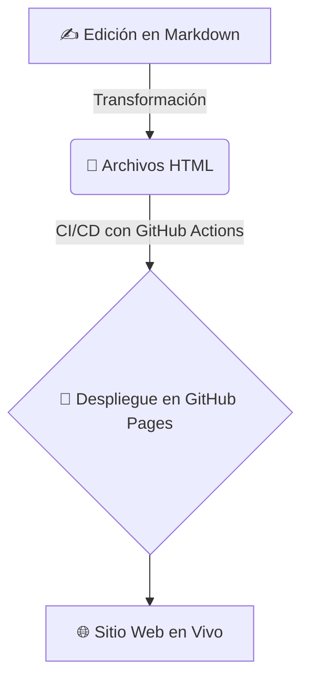

<div align="center">

# 🧠 Espacio Académico de Psicología

[](https://zarvent.github.io/25-psychology/)
[](https://github.com/zarvent/25-psychology/actions/workflows/gh-pages.yml)
[](https://github.com/zarvent/25-psychology/graphs/commit-activity)

<em>Un espacio personal para explorar y sintetizar los fundamentos de la mente humana a través del análisis y la investigación académica.</em>

</div>

---

> **Nota:**
> Este repositorio es mi rincón digital donde documento y comparto resúmenes y análisis sobre diversos temas de psicología. El objetivo es transformar notas de estudio en contenido web accesible, claro y visualmente agradable.

---

## 📚 Contenido Académico

| Área de Estudio                        | Descripción                                                                 | Acceso Directo                                                                 |
| -------------------------------------- | --------------------------------------------------------------------------- | ------------------------------------------------------------------------------ |
| **🧠 Psicología de los Procesos Básicos** | Un análisis profundo sobre los pilares de la cognición: percepción, atención, memoria y aprendizaje. | [➡️ Explorar Contenido](psicologia-de-los-procesos-basicos/index-psicologia-de-los-procesos-basicos.html) |

---

## 🛠️ Arquitectura del Proyecto (El Stack)

| Tecnología      | Propósito                                                                 |
| -------------- | ------------------------------------------------------------------------ |
| 🌐 **HTML5**   | Para la estructura semántica y la accesibilidad (a11y) del contenido.     |
| 🎨 **Tailwind CSS** | Para un diseño rápido, responsivo y coherente mediante clases de utilidad. |
| ✨ **JavaScript**   | Para añadir interactividad y animaciones sutiles que mejoran la experiencia de usuario (UX). |
| 🤖 **GitHub Actions** | Para la Integración y Despliegue Continuo (CI/CD) que publica el sitio en GitHub Pages. |

---

## 🔄 Flujo de Contenido



---

## 🗺️ Hoja de Ruta (Roadmap)

- [x] Estructura inicial del repositorio.
- [x] Contenido sobre Psicología de los Procesos Básicos.

---

## 🚀 Uso y Colaboración

Aunque este es un proyecto personal, eres libre de aportar tus ideas y ayuda a este repo.

<details>
<summary><strong>▶️ Cómo ejecutar este proyecto en tu máquina</strong></summary>

1. Clona el repositorio en tu máquina local:

   ```bash
   git clone https://github.com/zarvent/25-psychology.git
   ```

2. Navega al directorio del proyecto:

   ```bash
   cd 25-psychology
   ```

3. Abre el archivo `index.html` en tu navegador.
   - Puedes usar una extensión como "Live Server" en VS Code para una mejor experiencia.

</details>

<details>
<summary><strong>🤝 ¿Ideas o sugerencias?</strong></summary>

Si tienes alguna sugerencia para mejorar la estructura, el diseño o encuentras algún error, no dudes en abrir un <a href="https://github.com/zarvent/25-psychology/issues"><strong>Issue</strong></a>. ¡Toda retroalimentación es bienvenida!

</details>

---

## 🗂️ Estructura del Repositorio

```text
.
├── .github/
│   └── workflows/
│       └── gh-pages.yml      # 🤖 Flujo de trabajo para el despliegue automático
├── psicologia-de-los-procesos-basicos/
│   ├── index-psicologia-de-los-procesos-basicos.html  # 🚪 Portada del tema
│   ├── psicologia de los procesos basicos.md          # ✍️ Contenido en Markdown
│   └── psicologia-de-los-procesos-basicos.html        # 📄 Artículo formateado
├── index.html                # 🏠 Página principal del proyecto
└── README.md                 # 👈 Estás aquí
```

---

<p align="center">
Hecho con curiosidad por <a href="https://github.com/zarvent" target="_blank">Sebastián Zambrana</a>.
</p>
