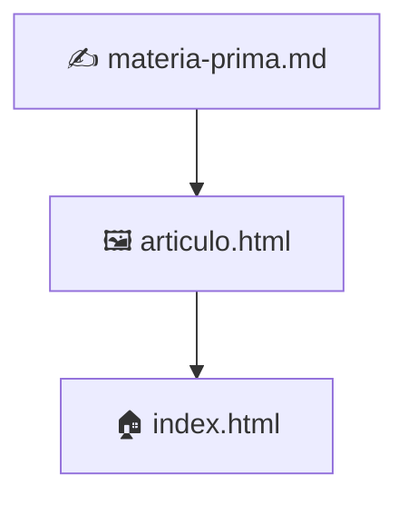

<!--
README.md optimizado al máximo nivel de Markdown, con secciones visuales, tablas, badges, detalles colapsables y diagramas ASCII para una experiencia de lectura memorable y profesional.
-->

<h1 align="center">🧠 Psicología y Código: Un Experimento Visual</h1>

<p align="center">
  <a href="https://zarvent.github.io/25-psicologia-de-los-procesos-basicos/" title="Ver Proyecto">
    
  </a>
  
  
</p>

---

---

## 🚀 ¿Cómo está hecho? (La Parte Técnica)

| Tecnología         | Propósito                                                                 |
|-------------------|--------------------------------------------------------------------------|
| 🌐 **HTML5**      | Estructura semántica, accesibilidad (a11y) y SEO                         |
| 🎨 **TailwindCSS**| Diseño utility-first, responsivo y consistente                            |
| ✨ **JavaScript**  | Animaciones sutiles (IntersectionObserver) para mejorar la experiencia   |
| 🤖 **GitHub Actions** | CI/CD: despliegue automático a GitHub Pages en cada push a `main`     |

---

## 🗂️ Flujo del Contenido



- **Materia Prima**: Todo el contenido académico vive en `materia-prima.md` (Markdown editable).
- **Presentación**: `articulo.html` da formato visual y añade interacciones.
- **Portada**: `index.html` es la bienvenida y punto de entrada.

---

## 🔭 ¿Qué vas a encontrar?

- 🎨 **Diseño limpio**: Lectura cómoda y sin distracciones.
- 📊 **Visualizaciones**: Gráficos SVG para conceptos clave.
- ⚡ **Carga rápida**: Sin grandes librerías, máxima velocidad.
- 📖 **Código abierto**: Simple, claro y reutilizable.

---

## 💡 Ideas para el futuro

- [ ] Añadir más información y recursos.
- [ ] Crear un mazo de Anki para repaso.
- [ ] Hacerlo multilingüe (es/en).
- [ ] Conectar un Headless CMS.
- [ ] Crear Web Components reutilizables.

---

## 🙌 ¿Quieres usarlo o proponer mejoras?

¡Adelante! Clona, experimenta o contribuye. Toda idea es bienvenida.

<details>
<summary><strong>▶️ Cómo probarlo en tu máquina</strong></summary>

```bash
# Clona el repositorio
 git clone https://github.com/zarvent/25-psicologia-de-los-procesos-basicos.git
 cd 25-psicologia-de-los-procesos-basicos

# Abre los archivos directamente
 index.html
 articulo.html

# (Opcional) Servidor local con Python 3
 python -m http.server
# Luego visita http://localhost:8000
```

</details>

<details>
<summary><strong>🤝 Cómo contribuir</strong></summary>

1. Haz un **Fork** del repositorio.
2. Crea una rama: `git checkout -b feature/mi-idea-genial`
3. Realiza tus cambios y haz commit.
4. Haz push: `git push origin feature/mi-idea-genial`
5. Abre un **Pull Request** hacia `main`.

</details>

---

## 📂 Estructura del Repositorio

```text
.
├── .github/
│   └── workflows/
│       └── gh-pages.yml      # 🤖 CI/CD para despliegue
├── articulo.html             # 📄 Artículo principal
├── index.html                # 🏠 Portada
├── materia-prima.md          # ✍️ Contenido académico
├── .nojekyll                 # 🚫 Desactiva Jekyll
└── README.md                 # 📘 Este archivo
```

---
